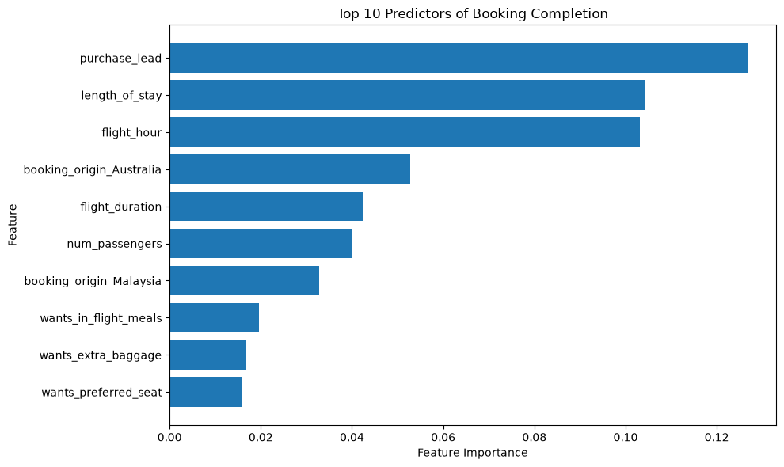
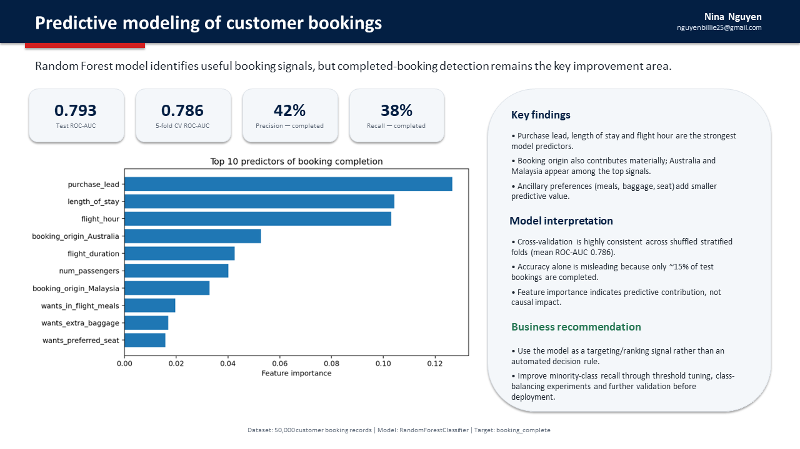
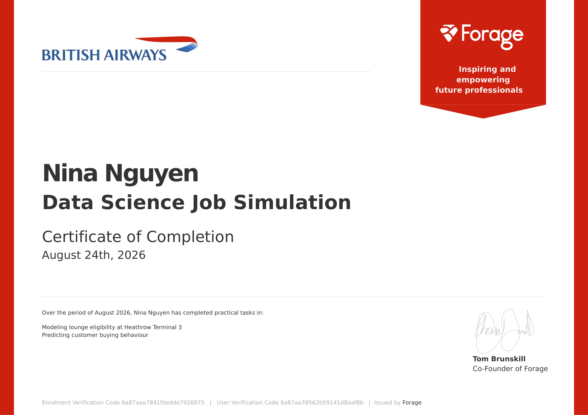

# British Airways Data Science Job Simulation

## Project Overview

This repository documents my work from the **British Airways Data Science Job Simulation on Forage**, completed in August 2026.

The simulation involved two practical business problems:

1. **Modeling lounge eligibility at Heathrow Terminal 3**
2. **Predicting customer booking behaviour**

The project provided hands-on experience in translating business questions into analytical assumptions, exploring customer data, building and evaluating a machine learning model, interpreting model outputs, and communicating findings to business stakeholders.

---

## Project Deliverables

| Task | Deliverable | Description |
|---|---|---|
| Task 1 | [Lounge Eligibility Analysis](lounge-eligibility-analysis.xlsx) | Excel-based analysis using business assumptions to model lounge eligibility |
| Task 2 | [Customer Booking Predictive Model](customer-booking-predictive-model.ipynb) | Python notebook containing EDA, data preparation, Random Forest modeling and evaluation |
| Presentation | [Executive Summary](customer-booking-model-summary.pptx) | One-slide PowerPoint communicating model performance and business findings |
| Visualization | [Feature Importance](feature-importance.png) | Visualization of the top predictors of booking completion |
| Certificate | [Forage Completion Certificate](british-airways-forage-certificate.pdf) | British Airways Data Science Job Simulation completion certificate |

> **Dataset:** The customer booking dataset contained 50,000 records and was provided as part of the British Airways Data Science Job Simulation on Forage. The original source dataset is not redistributed in this repository.

---

# Task 1 — Lounge Eligibility Modeling

## Objective

Estimate lounge eligibility at Heathrow Terminal 3 by translating business requirements and assumptions into a structured analytical model.

## What I Practiced

- Developing assumptions from an ambiguous business problem
- Translating business requirements into measurable inputs
- Structuring data to support business analysis
- Considering how analytical assumptions affect operational planning
- Communicating methodology and findings clearly to stakeholders

### Skills

`Assumption Development` `Data Modeling` `Business Analysis` `Communication` `Excel`

---

# Task 2 — Predicting Customer Booking Behaviour

## Objective

Build a machine learning model to predict whether a customer will complete a flight booking.

The analysis used **50,000 customer booking records**, with:

`booking_complete`

as the target variable.

---

## Exploratory Data Analysis

I explored booking completion across several customer and trip characteristics, including:

- Sales channel
- Trip type
- Purchase lead time
- Booking origin
- Extra baggage preference
- Preferred seat preference
- In-flight meal preference

### Selected Findings

**Sales Channel**

Internet customers had a booking completion rate of approximately **15.48%**, compared with **10.84%** for mobile customers.

**Trip Type**

Round-trip customers had the highest booking completion rate at approximately **15.06%**, compared with **5.17%** for one-way and **4.31%** for circle-trip customers.

**Purchase Lead**

Customers booking within **0–30 days** had the highest completion rate among the analysed purchase-lead groups at approximately **16.45%**.

**Booking Origin**

Among the ten largest booking origins by booking volume, **Malaysia had the highest completion rate at approximately 34.40%**.

Australia generated the largest booking volume but had a much lower completion rate of approximately **5.04%**.

**Ancillary Preferences**

Customers requesting extra baggage, preferred seats, or in-flight meals generally showed higher booking completion rates than customers who did not request these services.

---

## Data Preparation

Categorical variables were transformed using **one-hot encoding**.

The final modeling dataset contained:

- **50,000 observations**
- **918 predictor variables**

The dataset was split into:

- **80% training data — 40,000 records**
- **20% testing data — 10,000 records**

A stratified split was used to preserve the target-class distribution.

---

## Machine Learning Model

I trained a **Random Forest Classifier** to predict booking completion.

Random Forest was selected because it:

- Handles nonlinear relationships
- Works effectively with a large number of features
- Provides feature importance for model interpretation

Because completed bookings represented a minority class, class weighting was used during training.

---

## Model Evaluation

| Metric | Result |
|---|---:|
| Test ROC-AUC | **0.793** |
| Mean 5-Fold CV ROC-AUC | **0.786** |
| Accuracy | **0.83** |
| Precision — Completed Booking | **0.42** |
| Recall — Completed Booking | **0.38** |
| F1-score — Completed Booking | **0.40** |

The shuffled stratified 5-fold cross-validation produced a mean ROC-AUC of approximately **0.786**, with highly consistent scores across folds.

Because booking completion was imbalanced, **accuracy alone was not sufficient to evaluate model quality**. ROC-AUC, precision, recall, and F1-score were therefore considered alongside accuracy.

---

## Feature Importance

The Random Forest model identified the following variables as some of the strongest predictive signals:

| Feature | Importance |
|---|---:|
| Purchase lead | **12.67%** |
| Length of stay | **10.43%** |
| Flight hour | **10.31%** |
| Booking origin — Australia | **5.27%** |
| Flight duration | **4.25%** |
| Number of passengers | **4.01%** |
| Booking origin — Malaysia | **3.28%** |
| Wants in-flight meals | **2.00%** |
| Wants extra baggage | **1.69%** |
| Wants preferred seat | **1.57%** |

### Top 10 Predictors of Booking Completion

> **Note:** Feature importance represents predictive contribution within the model and should not be interpreted as causation.

---

## Business Interpretation

The analysis suggests that **booking timing and trip characteristics are important signals of booking completion**.

Purchase lead, length of stay, and flight hour were the three strongest individual predictors in the Random Forest model.

The exploratory analysis also highlighted several behavioural differences:

- Internet customers converted at a higher rate than mobile customers.
- Round-trip customers showed substantially higher completion rates than other trip types.
- High booking volume did not necessarily mean high conversion. Australia generated the most bookings, while Malaysia showed a substantially higher completion rate among the ten largest booking origins.
- Customers selecting ancillary services generally demonstrated higher booking completion rates.

The model showed useful ranking ability, although predicting customers who actually completed a booking remained more difficult than predicting non-completers.

---

## Potential Next Steps

Before operational deployment, I would explore:

- Classification threshold tuning
- Alternative class-balancing techniques
- Additional feature engineering
- Comparison with alternative classification models
- Further out-of-sample validation

The model could initially be explored as a **customer propensity ranking or targeting signal** rather than an automated decision rule.

---

# Executive Summary

The final findings were summarized in a **single-slide PowerPoint presentation** for a business stakeholder.

### Presentation Files

- [View / Download PowerPoint Summary](customer-booking-model-summary.pptx)
- [View Presentation Preview](customer-booking-model-summary.PNG)

---

# Tools & Skills

### Data & Technical

`Python` `Pandas` `scikit-learn` `Random Forest` `Machine Learning` `Data Modeling` `Data Visualization` `Exploratory Data Analysis` `Cross-Validation` `Feature Importance` `Excel`

### Business & Communication

`Assumption Development` `Business Interpretation` `Analytical Communication` `PowerPoint`

---

# Key Takeaway

The most important lesson from this simulation was that predictive modeling is not only about training an algorithm.

A complete analytical workflow requires connecting each stage:

**Business Problem → Assumptions → Data Exploration → Data Preparation → Modeling → Validation → Interpretation → Communication**

The exercise reinforced the importance of evaluating a model with appropriate metrics, interpreting its outputs carefully, and translating technical findings into information that business stakeholders can use.

---

# Certificate

**British Airways Data Science Job Simulation — Forage**

**Completed:** August 24, 2026

Practical tasks completed:

- Modeling lounge eligibility at Heathrow Terminal 3
- Predicting customer buying behaviour

[View / Download Certificate](british-airways-forage-certificate.pdf)

### Certificate Preview

---

## Disclaimer

This repository documents my personal learning, analysis, and deliverables from the British Airways Data Science Job Simulation on Forage.

The original simulation dataset and proprietary source materials are **not redistributed** in this repository.
